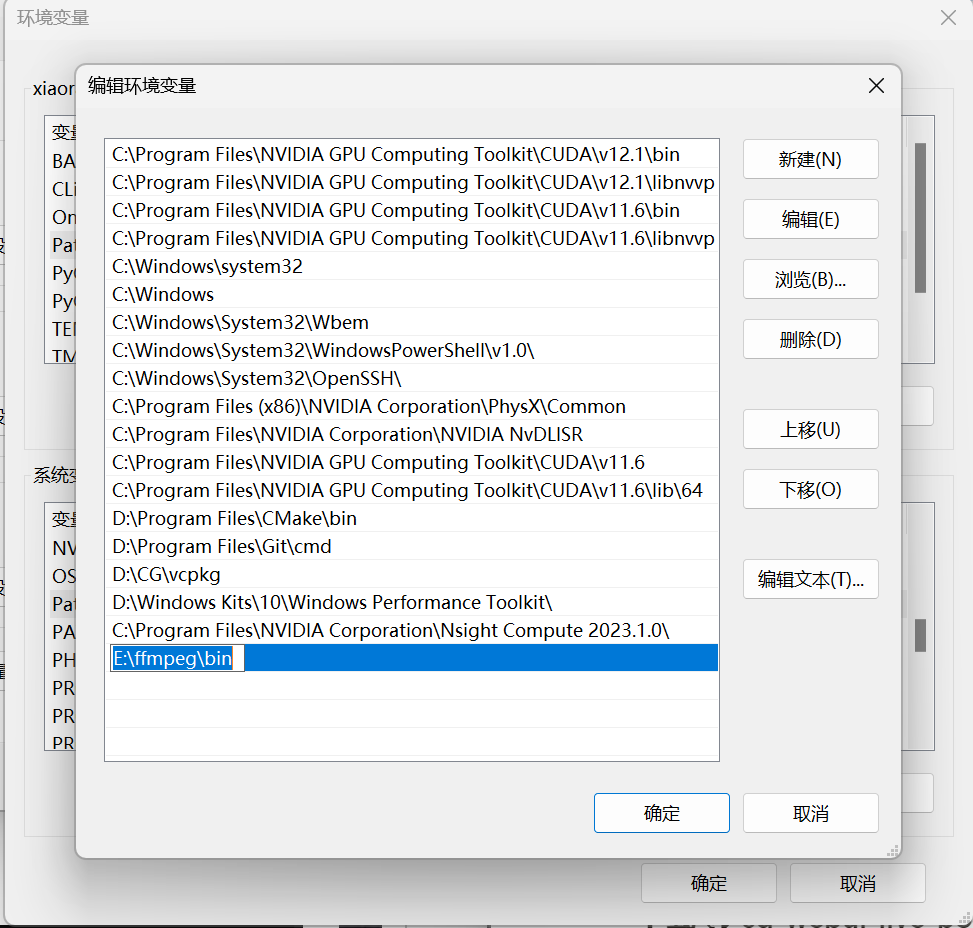

# DigitalHuman 

DigitalHuman 是 SD webui forge 的一个扩展，可以生成数字人，

## 相关支撑下载

### 一、FFmpeg 下载 (windows)

1、官网下载 windows 版本

[Download FFmpeg](https://www.ffmpeg.org/download.html#build-windows)

2、把 FFmpeg 加到 环境变量中



### 二、web ui forge 下载

项目地址 https://github.com/lllyasviel/stable-diffusion-webui-forge 官网下载 windows 一键启动


1. 解压缩并进入 `webui_forge_cu121_torch231` 目录中
2. 下载 [flux1-dev-bnb-nf4-v2.safetensors](https://huggingface.co/lllyasviel/flux1-dev-bnb-nf4/blob/main/flux1-dev-bnb-nf4-v2.safetensors) 放到 `webui_forge_cu121_torch231\webui\models\Stable-diffusion\` 目录下

3. 修改 webui_forge\webui\requirements_versions.txt

```einops==0.4.1 → einops==0.6.1```

4. 执行 `update.bat`
5. 执行 `run.bat`

### 三、LivePortrait 插件安装

项目原地址 https://github.com/KwaiVGI/LivePortrait

#### 下载LivePortrait sd插件

项目地址： https://github.com/dimitribarbot/sd-webui-live-portrait

1. 打开“Extensions”选项卡。 
2. 在选项卡中打开“Install from URL”选项卡。 
3. 输入 [https://github.com/dimitribarbot/sd-webui-live-portrait.git](https://github.com/dimitribarbot/sd-webui-live-portrait.git) 到“URL for extension's git repository”。 
4. 按“Install”按钮。 
5. 安装可能需要几分钟，因为 XPose 可能会被编译。最后，您将看到消息“Installed into stable-diffusion-webui\extensions\sd-webui-live-portrait. Use Installed tab to restart。
6.  转到“Installed”选项卡，单击“Check for updates”，然后单击“Apply and restart UI”。 （下次您还可以使用这些按钮来更新此扩展。）

#### 在 SD webui forge 不能直接用sd-webui-live-portrait，有一些error(SD webui forge是gradio4+有一些改动)

- All model fields require a type annotation; if flag stitching retargeting input' is not meant to be a field, you maybe able to resolve this error by annotating it as a 'ClassVar' or updating model config ' ignored types '] ,
    
    
    
    `webui_forge_cu121_torch231\webui\extensions\sd-webui-live-portrait\scripts\api.py` 注销515、589
    
    
    
    
    
- ValueError: Invalid value for parameter 'type': file. Please choose from one of: ['filepath' , ' binary']
    
    
    
    `webui_forge_cu121_torch231\webui\extensions\sd-webui-live-portrait\scripts\main.py` 修改 350 行
    
    
    
- TypeError: save_pil_to_file() got an unexpected keyword argument 'name’
    
    
    
    gr.Image() 4.+  `gr.Image(type="filepath")` 有点问题 
    
    `webui_forge_cu121_torch231\webui\extensions\sd-webui-live-portrait\scripts\main.py` 
    
    366 行
    
    
    
    331 行
    
    
    
    346 行
    
    
    
    661 行
    
    
    
    上边这几行的 `source_image_input = gr.Image(type="filepath")`  都改成 `source_image_input = gr.Image()`
    
    
    
    2222********************************************************************************
    
    
    
    改成
    
    ```python
    from PIL import Image
    import numpy as np
    
        def gpu_wrapped_execute_video(*args, **kwargs):
            # print("Args:", args)
            tmp_args = list(args)
            if isinstance(tmp_args[0], np.ndarray):
                # print("tmp_args[0]:", isinstance(tmp_args[0], np.ndarray))
                source_image_input_path = 'extensions/sd-webui-live-portrait/source_image_input.jpg'
                tmp_img = Image.fromarray(tmp_args[0])
                tmp_img.save(source_image_input_path)
                tmp_args[0] = source_image_input_path
            if isinstance(tmp_args[4], np.ndarray):
                driving_image_input = 'extensions/sd-webui-live-portrait/driving_image_input.jpg'
                tmp_img = Image.fromarray(tmp_args[4])
                tmp_img.save(driving_image_input)
                tmp_args[4] = driving_image_input
            if isinstance(tmp_args[5], np.ndarray):
                driving_image_webcam_input = 'extensions/sd-webui-live-portrait/driving_image_webcam_input.jpg'
                tmp_img = Image.fromarray(tmp_args[5])
                tmp_img.save(driving_image_webcam_input)
                tmp_args[5] = driving_image_webcam_input
    
            pipeline = init_gradio_pipeline()
            return pipeline.execute_video(*tmp_args, **kwargs)
    ```
    
    
    

#### 下载模型

[https://huggingface.co/Kijai/LivePortrait_safetensors/tree/main](https://huggingface.co/Kijai/LivePortrait_safetensors/tree/main) 

model放置：(human)

`webui_forge_cu121_torch231\webui\models\liveportrait`

```bash
liveportrait
|_base_models
|__appearance_feature_extractor.safetensors
|__gitattributes
|__landmark_model.pth
|__motion_extractor.safetensors
|__spade_generator.safetensors
|__warping_module.safetensors
|__retargeting_models
|__stitching_retargeting_module.safetensors
|_landmark.onnx
```

`webui_forge_cu121_torch231\webui\models\insightface\models\buffalo_l\`

```bash
buffalo_l
|_2d106det.onnx
|_det_10g.onnx
```

## DigitalHuman 插件

位置：放在 `webui_forge\webui\extensions`

下载本项目
```git clone https://github.com/xiaoranGong/DigitalHuman.git```

### 本项目使用的开源仓库
#### DH_live
数字人形象，音频驱动数字人项目。

 项目地址：https://github.com/kleinlee/DH_live

#### Edge TTS
文本转语音项目。

原项目地址：https://github.com/rany2/edge-tts.git

#### Qwen2
Qwen2是阿里云Qwen团队开发的大型语言模型系列。

原项目地址：https://github.com/QwenLM/Qwen2